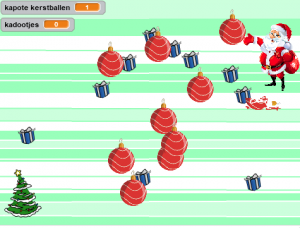
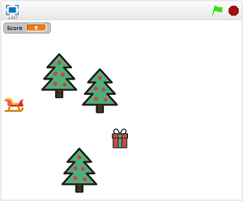

Op zaterdag 21 december is het thema Kerst! We gaan kerst spellen en animaties maken met Scratch en kerstverlichting hacken met de Microbits.

## Scratch: Help de kerstman

{:class="alignleft"} Voor de kersteditie in 2018 had Ines een leuk spel gemaakt waarin je de kerstman mag helpen cadeautje te verzamelen. Maar pas op voor de kerstballen, want anders breken ze!

[Hier](/2018/12/15/scratch-kerstspel.html) vind je de uitleg hoe je dit spel ook kunt maken. En daarna zijn we natuurlijk benieuwd hoe jij het spel nog leuker kunt maken.

Je kunt ook het hele spel [hier](https://scratch.mit.edu/projects/266961980/#player) bekijken.

## Scratch: Verzamel de pakjes, maar pas op voor de bomen

{:class="alignleft"} In 2016 maakten we een spel dat door [leswiki.nl](https://www.leswiki.nl/themas-en-projecten/scratchles-een-kerstspel-maken) gemaakt was. Je moet de kerstman helpen pakjes te verzamelen, terwijl je probeert de bomen te ontwijken.

Hier vind je [de uitleg](/static/pdf/Scratch-Kerstspel.pdf) om het spel zelf te maken. De afbeeldingen die bij de les horen kun je [hier downloaden](https://www.dropbox.com/s/md7ci770j367g6a/Scratch%20Kerstles%20afbeeldingen.zip?dl=0).

Een kant-en-klaar voorbeeld staat [hier](https://scratch.mit.edu/projects/91302807)

## Microbit
