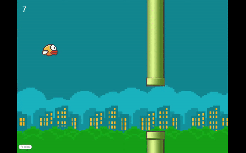
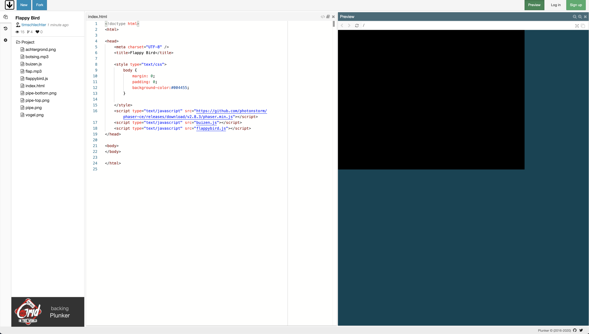
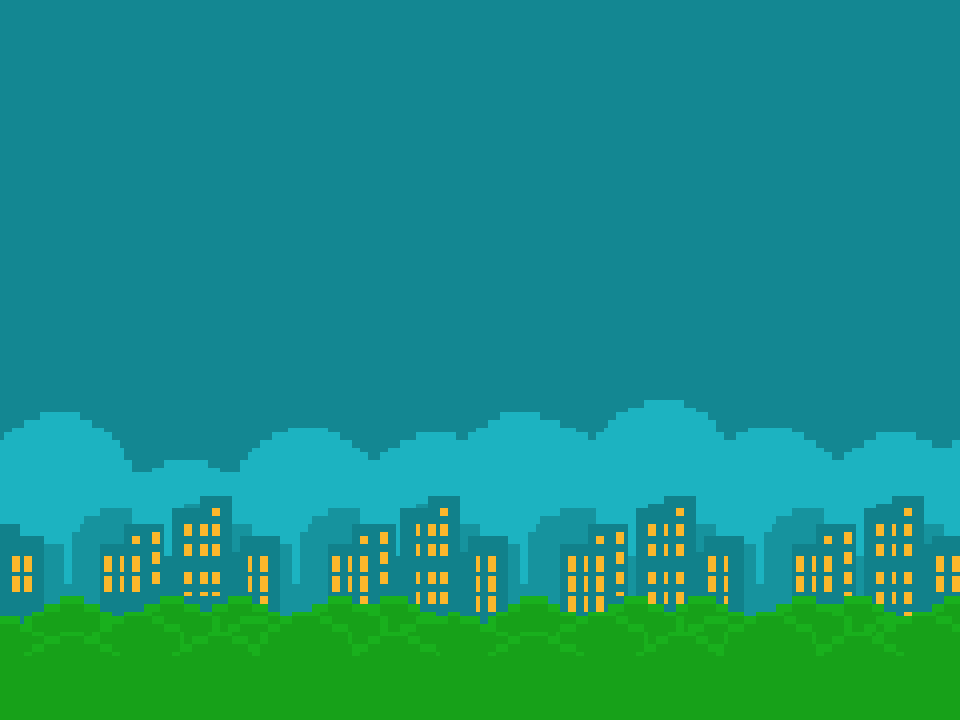
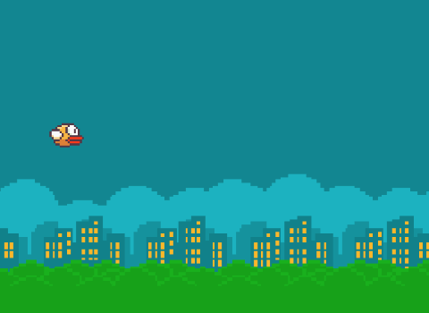
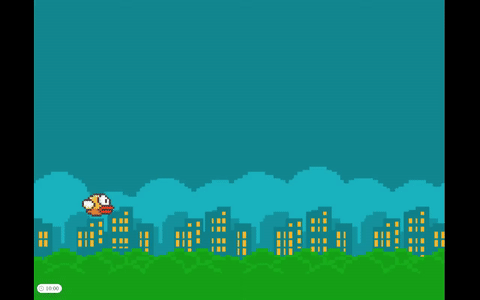
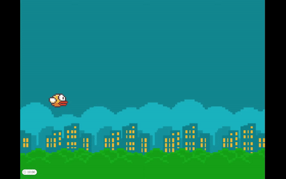
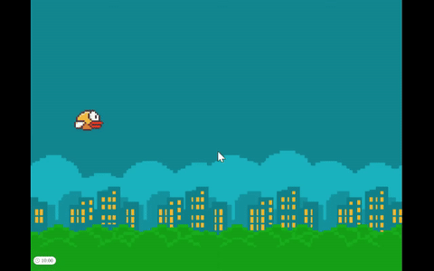
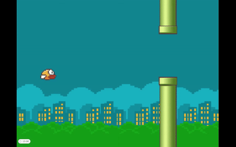

* Inhoudsopgrave
{:toc}

Flappy Bird
-----------
We gaan vandaag het spelleltje Flappy Bird programmeren in JavaScript. In Flappy Bird moet je het vogeltje tussen de buizen door laten vliegen, zonder er tegenaan te botsen. Dat klinkt eenvoudig, maar is lastiger dan je denkt!

{:class="screenshot"}

Punker
-----------

We gaan werken in Plunker. Dit is een online _editor_ waarin we onze JavaScript code gaan schrijven. 


<div style="text-align:center"><h3><a href="https://plnkr.co/edit/Wk678qILLlsUyY6S?preview" target="_blank">Klik hier om Plunkr te openen</a></h3></div>

Als het goed is zie je nu dit scherm:



<hr />
TODO: uitleg over Plunker
- onderdelen op het scherm: bestanden, editor, uitvoeren
- 'Fork' om een kopie van de code te maken waarin we gaan werken
<hr />

We gaan onze code schrijven in het bestand ```flappybird.js```. Klik maar eens op dit bestand, als het goed is zie je nu deze code in het code venster:

```javascript
var state = {
  preload: function () {
    // Hier laad je alle plaatjes en geluiden in het geheugen van de computer
  },

  create: function () {
    // hier zet je code neer die 1 keer uitgevoerd moet worden, wanneer je spel 
    // opstart
  },

  update: function () {
    // Hier zet je code neer die steeds opnieuw uitgevoerd wordt. Je kunt
    // bijvoorbeeld controleren of 2 dingen met elkaar botsen.
  }
}
```

Als je goed kijkt ziet je computer code staan, maar ook 'gewone' Nederlandse zinnen. We noemen dit _commentaar_, en we gebruiken dat om uit te leggen wat de code doet. Je kunt _commentaar_ schrijven door een regel te beginnen met `//`.


De achtergrond instellen
--------------------------------
Er gebeurt nog niet zo veel in ons spel, je ziet alleen maar een zwart vlak. We gaan eerst maar eens een mooie achtergrond instellen.

We gaan hiervoor het plaatje `achtergrond.png` inladen. Dat doe je door eerst het plaatje in het geheugen van de computer te laden. Voeg deze regel toe aan de  ```preload``` functie, _voor_ de `}`:
```javascript
game.load.image('achtergrond', 'achtergrond.png');
```

De `preload` functie ziet er als het goed is nu zo uit:

```javascript:
preload: function () {
  // Hier laad je alle plaatjes en geluiden in het geheugen van de computer
  game.load.image('achtergrond', 'achtergrond.png');
},
```

Voeg in de ```create``` functie het achtergrondplaatje als _sprite_ toe. Maak de _sprite_ net zo groot als het scherm van ons spel:


```javascript
this.background = game.add.sprite(0, 0, 'achtergrond');
this.background.width = game.width;
this.background.height = game.height;
```

Als het goed is zie je nu de achtergrond verschijnen.

{:class="screenshot"}

> Een _sprite_ is een plaatje dat in een game gebruikt wordt.

### Controlepunt
Als het goed is ziet je code er nu zo uit:

```javascript
var state = {
  preload: function () {
    // Hier laad je alle plaatjes en geluiden in het geheugen van de computer
    game.load.image('achtergrond', 'achtergrond.png');
  },

  create: function () {
    // Hier zet je code neer die 1 keer uitgevoerd moet worden, wanneer je spel 
    // opstart
    this.background = game.add.sprite(0, 0, 'achtergrond');
    this.background.width = game.width;
    this.background.height = game.height;
  },

  update: function () {
    // Hier zet je code neer die steeds opnieuw uitgevoerd wordt. Je kunt
    // bijvoorbeeld controleren of 2 dingen met elkaar botsen.
  }
}

var game = new Phaser.Game(640, 480, Phaser.CANVAS);
game.state.add('main', state);
game.state.start('main');
```

De vogel op het scherm tekenen
--------------------------------------

Alleen naar een achtergrond kijken is ook maar saai. Laten we Flappy zelf eens in het spel zetten.

Laad in de ```preload``` functie het plaatje van Flappy Bird in het geheugen van de computer.

```javascript
game.load.spritesheet('vogel', 'vogel.png', 68, 48, 3);
```

En zet nu de Flappy _sprite_ in het spel in de ```create``` functie:
```javascript
this.flappy = game.add.sprite(100, 245, 'vogel');
```

Als het goed is ie je Flappy nu in het spel verschijnen!

{:class="screenshot"}

> Een `spritesheet` is een afbeelding waarin meerdere uiterlijken van een sprite staan. Open het bestand `vogel.png` maar eens. Je zult dan een afbeelding zien met `3` vogels; elke vogel is `68` pixels hoog en `48` pixels breed. We gaan dit straks nodig hebben om de vogel te laten vliegen.

### Controlepunt
Als het goed is ziet je code er nu zo uit:

```javascript
var state = {
  preload: function () {
    // Hier laad je alle plaatjes en geluiden in het geheugen van de computer
    game.load.image('achtergrond', 'achtergrond.png');
    game.load.spritesheet('vogel', 'vogel.png', 68, 48, 3);
  },

  create: function () {
    // Hier zet je code neer die 1 keer uitgevoerd moet worden, wanneer je spel 
    // opstart
    this.background = game.add.sprite(0, 0, 'achtergrond');
    this.background.width = game.width;
    this.background.height = game.height;

    this.flappy = game.add.sprite(100, 245, 'vogel');
  },

  update: function () {
    // Hier zet je code neer die steeds opnieuw uitgevoerd wordt. Je kunt
    // bijvoorbeeld controleren of 2 dingen met elkaar botsen.
  }
}

var game = new Phaser.Game(640, 480, Phaser.CANVAS);
game.state.add('main', state);
game.state.start('main');
```

De vogel laten vallen
---------------------

Er gebeurt nog weinig in ons spel. We gaan straks Flappy leren vliegen, maar eerst gaan we hem laten vallen.

We doen dit door _physics_ aan ons spel toe te voegen. 

Voeg deze regel toe in de ```create``` functie :
```javascript
game.physics.startSystem(Phaser.Physics.ARCADE);
```

We gaan nu met deze _physics_ de zwaartekracht instellen op Flappy. 

Hiervoor voeg je nog 2 regels code aan je programma toe in de ```create``` functie:

```javascript
game.physics.arcade.enable(this.flappy);
this.flappy.body.gravity.y = 1000;
```

En meteen valt Flappy van het scherm! 😱

{:class="screenshot"}

### Controlepunt
Als het goed is ziet je code er nu zo uit:

```javascript
var state = {
  preload: function () {
    // Hier laad je alle plaatjes en geluiden in het geheugen van de computer
    game.load.image('achtergrond', 'achtergrond.png');
    game.load.spritesheet('vogel', 'vogel.png', 68, 48, 3);
  },

  create: function () {
    // Hier zet je code neer die 1 keer uitgevoerd moet worden, wanneer je spel 
    // opstart
    this.background = game.add.sprite(0, 0, 'achtergrond');
    this.background.width = game.width;
    this.background.height = game.height;

    this.flappy = game.add.sprite(100, 245, 'vogel');

    game.physics.startSystem(Phaser.Physics.ARCADE);
    game.physics.arcade.enable(this.flappy);
    this.flappy.body.gravity.y = 1000;
  },

  update: function () {
    // Hier zet je code neer die steeds opnieuw uitgevoerd wordt. Je kunt
    // bijvoorbeeld controleren of 2 dingen met elkaar botsen.
  }
}

var game = new Phaser.Game(640, 480, Phaser.CANVAS);
game.state.add('main', state);
game.state.start('main');
```

De vogel laten vliegen
----------------------
Als je het spel nu start, zal de vogel als een baksteen naar beneden vallen. Laten we er voor zorgen dat ze kan vliegen.

{:class="screenshot"}

Voeg in de ```create``` functie de volgende regel toe:
```javascript
var spaceKey = game.input.keyboard.addKey(Phaser.Keyboard.SPACEBAR);
spaceKey.onDown.add(this.flap, this);   
```

Met de regels hierboven zorgen we er voor dat wanneer de `spatiebalk` ingedrukt wordt, het spel de _functie_ `flap` van ons `state` _object_ uitvoert. 

Deze funtie bestaat nog niet, dus die moeten we toevoegen aan het `state` _object_. Voeg deze code _onder_ de `update` functie toe:

```javascript
flap: function() {
  this.flappy.body.velocity.y = -350;
}
```

Zodat de code van het `state` _object_ er zo uitziet:

```javascript
var state = {
  preload: function() { 
    ...
  },
  create: function() { 
    ...
  },
  update: function() { 
    ...
  }, // <-- Let op dat je deze komma niet vergeet!
  flap: function() {
    this.flappy.body.velocity.y = -350;
  }
}
```

Doordat we in de ```flap ``` functie de vogel een _y-snelheid_ meegeven, vliegt ze eventjes omhoog. Maar door de zwaartekracht die we in stap 3 op de vogel ingesteld hebben, zal ze snel weer naar beneden vallen.

### Controlepunt
Als het goed is ziet je code er nu zo uit:

```javascript
var state = {
  preload: function () {
    // Hier laad je alle plaatjes en geluiden in het geheugen van de computer
    game.load.image('achtergrond', 'achtergrond.png');
    game.load.spritesheet('vogel', 'vogel.png', 68, 48, 3);
  },

  create: function () {
    // Hier zet je code neer die 1 keer uitgevoerd moet worden, wanneer je spel 
    // opstart
    this.background = game.add.sprite(0, 0, 'achtergrond');
    this.background.width = game.width;
    this.background.height = game.height;

    this.flappy = game.add.sprite(100, 245, 'vogel');

    game.physics.startSystem(Phaser.Physics.ARCADE);
    game.physics.arcade.enable(this.flappy);
    this.flappy.body.gravity.y = 1000;

    var spaceKey = game.input.keyboard.addKey(Phaser.Keyboard.SPACEBAR);
    spaceKey.onDown.add(this.flap, this);   
  },

  update: function () {
    // Hier zet je code neer die steeds opnieuw uitgevoerd wordt. Je kunt
    // bijvoorbeeld controleren of 2 dingen met elkaar botsen.
  },
  flap: function() {
    this.flappy.body.velocity.y = -350;
  }
}

var game = new Phaser.Game(640, 480, Phaser.CANVAS);
game.state.add('main', state);
game.state.start('main');

```

Geluid en animatie toevoegen
----------------------------
Onze vogel kan nu wel vliegen, maar het ziet er een beetje saai uit. 

Voeg een vlieg-animatie toe aan `flappy` door deze code in de ```create``` functie te zetten:
```javascript
this.flappy.animations.add('fly');
```

En start de animatie iedere keer dat de ```flap``` functie uitgevoerd wordt, door deze code aa de `flap` functie toe te voegen:
```javascript
this.flappy.animations.play('fly', 10, false);
```

{:class="screenshot"}

> Deze code speelt de drie plaatjes in de _spritesheet_ van de vogel een-voor-een af. ```10``` keer per seconde wordt het volgende plaatje getoond, waardoor het lijkt alsof de vleugels van de vogel wapperen. 

Laad nu het ```flap``` geluidsbestand in het geheugen van de computer door in de ```preload``` functie deze code toe te voegen:

```javascript
game.load.audio('flap', 'flap.mp3');
```

Maak het flap geluid bekend in het spel door deze code in de ```create``` functie te zetten:

```javascript
this.flapGeluid = game.add.audio('flap');
```

Speel het geluid af iedere keer wanneer de ```flap``` functie uitgevoerd wordt:
```javascript
this.flapGeluid.play();
```

### Controlepunt
Als het goed is ziet je code er nu zo uit:

```javascript
var state = {
  preload: function () {
    // Hier laad je alle plaatjes en geluiden in het geheugen van de computer
    game.load.image('achtergrond', 'achtergrond.png');
    game.load.spritesheet('vogel', 'vogel.png', 68, 48, 3);
    game.load.audio('flap', 'flap.mp3');
  },

  create: function () {
    // Hier zet je code neer die 1 keer uitgevoerd moet worden, wanneer je spel 
    // opstart
    this.background = game.add.sprite(0, 0, 'achtergrond');
    this.background.width = game.width;
    this.background.height = game.height;

    this.flappy = game.add.sprite(100, 245, 'vogel');

    game.physics.startSystem(Phaser.Physics.ARCADE);
    game.physics.arcade.enable(this.flappy);
    this.flappy.body.gravity.y = 1000;

    var spaceKey = game.input.keyboard.addKey(Phaser.Keyboard.SPACEBAR);
    spaceKey.onDown.add(this.flap, this);

    this.flappy.animations.add('fly'); 

    this.flapGeluid = game.add.audio('flap');
  },

  update: function () {
    // Hier zet je code neer die steeds opnieuw uitgevoerd wordt. Je kunt
    // bijvoorbeeld controleren of 2 dingen met elkaar botsen.
  },
  flap: function() {
    this.flappy.body.velocity.y = -350;
    this.flappy.animations.play('fly', 10, false);
    this.flapGeluid.play();
  }
}

var game = new Phaser.Game(640, 480, Phaser.CANVAS);
game.state.add('main', state);
game.state.start('main');
```
Buizen laten verschijnen
--------------------------------
{:class="screenshot"}

Nu de vogel kan vliegen, gaan we het wat spannender maken. 

We gaan iedere 3 seconden rij met buizen laten verschijnen.

Hiervoor voegen we een ```timer``` toe in de ```create``` functie. 

```javascript
this.timer = game.time.events.loop(3000, this.maakBuizen, this);
```

Deze `timer` zorgt er voor dat iedere 3 secoden (= 3000 milliseconden) de functie ```maakBuizen``` uitgevoerd wordt.

De code voor het aanmaken van de buizen is wat lastiger, dus die krijg je cadeau! We moeten de code alleen nog even actiefc maken. 

Dit doe je door deze regel helemaal onderaan je programma toe te voegen:
```javascript
laadBuizen(state);
```


### Controlepunt
Als het goed is ziet je code er nu zo uit:

```javascript
var state = {
  preload: function () {
    // Hier laad je alle plaatjes en geluiden in het geheugen van de computer
    game.load.image('achtergrond', 'achtergrond.png');
    game.load.spritesheet('vogel', 'vogel.png', 68, 48, 3);
    game.load.audio('flap', 'flap.mp3');
  },

  create: function () {
    // Hier zet je code neer die 1 keer uitgevoerd moet worden, wanneer je spel 
    // opstart
    this.background = game.add.sprite(0, 0, 'achtergrond');
    this.background.width = game.width;
    this.background.height = game.height;

    this.flappy = game.add.sprite(100, 245, 'vogel');

    game.physics.startSystem(Phaser.Physics.ARCADE);
    game.physics.arcade.enable(this.flappy);
    this.flappy.body.gravity.y = 1000;

    var spaceKey = game.input.keyboard.addKey(Phaser.Keyboard.SPACEBAR);
    spaceKey.onDown.add(this.flap, this);

    this.flappy.animations.add('fly'); 

    this.flapGeluid = game.add.audio('flap');

    this.timer = game.time.events.loop(3000, this.maakBuizen, this);
  },

  update: function () {
    // Hier zet je code neer die steeds opnieuw uitgevoerd wordt. Je kunt
    // bijvoorbeeld controleren of 2 dingen met elkaar botsen.
  },
  flap: function() {
    this.flappy.body.velocity.y = -350;
    this.flappy.animations.play('fly', 10, false);
    this.flapGeluid.play();
  }
}

var game = new Phaser.Game(640, 480, Phaser.CANVAS);
game.state.add('main', state);
game.state.start('main');

laadBuizen(state);
```

Botsingen
-----------------
{:class="screenshot"}

Dit begint er al op te lijken. Maar Flappy vliegt nu nog dwars door de buizen heen. Zo is het wel een heel eenvoudig spelletje, daar gaan we iets aan doen!.

We gaan nu controleren of de vogel botst met een buis. We doen dit in de ```update``` functie, omdat die steeds opnieuw uitgevoerd wordt. 

Voeg deze code daarom aan de `update` functie toen:
```javascript
game.physics.arcade.overlap(this.flappy, this.buizen, this.botsing, null, this);
```

Als `flappy` met een  van de `buizen` botst, wordt de functie ```botsing``` uitgevoerd. 

Die functie bestaat nog niet, dus die voegen we toe aan het `state` _object_, net zoals we dat eerder met de `flap` functie gedaan hebben:

```javascript
var state = {
  preload: function() { 
    ...
  },
  create: function() { 
    ...
  },
  update: function() { 
    ...
  },
  flap: function() {
    ...
  }, // <-- Let op dat je de komma weer niet vergeet :-)
  botsing: function() {
    game.state.start('main');
  }
}
```

De code die in de `botsing` functie uitgevoerd wordt, zorgt er voor dat het spel opnieuw start.

Dus iedere keer dat `flappy` een `botsing` heeft met een van de `buizen` wordt het spel opnieuw gestart.

Laten we er nu nog even een echt botsing van maken door een geluidje af te spelen.  Laad het ```botsing``` geluidsbestand in het geheugen van de computer door in de ```preload``` functie deze code toe te voegen:

```javascript
game.load.audio('botsing', 'botsing.mp3');
```

Maak het botsing geluid bekend in het spel door deze code in de ```create``` functie te zetten:

```javascript
this.botsingGeluid = game.add.audio('botsing');
```

Speel het geluid af iedere keer wanneer de ```botsing``` functie uitgevoerd wordt:
```javascript
this.botsingGeluid.play();
```
### Controlepunt
Als het goed is ziet je code er nu zo uit:

```javascript
var state = {
  preload: function () {
    // Hier laad je alle plaatjes en geluiden in het geheugen van de computer
    game.load.image('achtergrond', 'achtergrond.png');
    game.load.spritesheet('vogel', 'vogel.png', 68, 48, 3);
    game.load.audio('flap', 'flap.mp3');
    game.load.audio('botsing', 'botsing.mp3');
  },

  create: function () {
    // Hier zet je code neer die 1 keer uitgevoerd moet worden, wanneer je spel 
    // opstart
    this.background = game.add.sprite(0, 0, 'achtergrond');
    this.background.width = game.width;
    this.background.height = game.height;

    this.flappy = game.add.sprite(100, 245, 'vogel');

    game.physics.startSystem(Phaser.Physics.ARCADE);
    game.physics.arcade.enable(this.flappy);
    this.flappy.body.gravity.y = 1000;

    var spaceKey = game.input.keyboard.addKey(Phaser.Keyboard.SPACEBAR);
    spaceKey.onDown.add(this.flap, this);

    this.flappy.animations.add('fly'); 

    this.flapGeluid = game.add.audio('flap');

    this.timer = game.time.events.loop(3000, this.maakBuizen, this);

    this.botsingGeluid = game.add.audio('botsing');
  },

  update: function () {
    // Hier zet je code neer die steeds opnieuw uitgevoerd wordt. Je kunt
    // bijvoorbeeld controleren of 2 dingen met elkaar botsen.
    game.physics.arcade.overlap(this.flappy, this.buizen, this.botsing, null, this);
  },
  flap: function() {
    this.flappy.body.velocity.y = -350;
    this.flappy.animations.play('fly', 10, false);
    this.flapGeluid.play();
  },
  botsing: function() {
    game.state.start('main');
    this.botsingGeluid.play();
  }
}

var game = new Phaser.Game(640, 480, Phaser.CANVAS);
game.state.add('main', state);
game.state.start('main');

laadBuizen(state);
```

Extra opdrachten
----------------

### Game over wanneer de vogel buiten het scherm komt
Hiervoor moeten we het spel laten controleren of de vogel buiten het scherm komt. Dit stel je op de vogel in de ```create``` functie in:
```javascript
create: function() {
  // ...
  this.bird.checkWorldBounds = true;
  this.bird.events.onOutOfBounds.add(this.hit, this);
}
```
> De code hierboven zorgt er voor dat de functie ```hit``` uitgevoerd wordt, zodra de vogel de rand van het scherm raakt.

### Score toevoegen
We laten de speler iedere seconde een punt verdienen. Dit doen we door in de ```create```functie een _variabele_ 'points' toe te voegen. We maken ook een _label_ aan waarmee we ```score``` op het scherm tekenen:
```javascript
create: function() {
  // ...
  this.points = 0;
  this.pointsLabel = game.add.text(20, 20, "0", {
    font: "30px Arial",
    fill: "#ffffff"
  });
}
```

Nu voegen we in de ```create``` functie een timer toe, waarmee we elke seconde een nieuwe functie ```score``` aanroepen:

```javascript
create: function() {
  // ...
  this.timer = game.time.events.loop(1000, this.score, this);
}

score: function() {
  this.points += 1;
  this.pointsLabel.text = this.points;
}
```

### Jouw beurt!
Wat kun je nog meer verzinnen om jouw spel n&oacute;g leuker te maken?

Om dit spel te maken hebben we [Phaser](http://phaser.io/) gebruikt. Op de site van Phaser vind je nog [veel meer voorbeelden met code](http://phaser.io/examples). Hier kun je dus eens rondneuzen om te kijken hoe anderen spellen gemaakt hebben.
