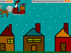
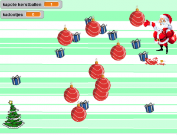

Kerst 2019
----------
Als je ze nog niet gedaan hebt kun je de kerstspellen van 2018 en 2016 doen, die hieronder te vinden zijn.

Hier nog een aantal kerstspellen van anderen die je als inspiratie kunt gebuiken voor een eigen spel. Je kunt zo ook zelf aanpassen door op de groene (*Remix*) knop te klikken.

{:class="alignleft"} Laat pakjes in de schoorsteen vallen

Kerst 2018
----------
{:class="alignleft"} We hebben een nieuw [kerstspel](/2018/12/15/scratch-kerstspel.html) voor dit jaar in Scratch! Help de kerstman om de kadootjes te verzamelen, maar pas op voor de kerstballen, anders breken ze!

De uitleg voor het KerstmanSpel in Scratch vind je [hier](/2018/12/15/scratch-kerstspel.html)!

Je kunt ook het hele spel [hier](https://scratch.mit.edu/projects/266961980/#player) bekijken.

Kerst 2016
----------
{:class="alignleft"} Hier is [een uitleg](/static/pdf/Scratch-Kerstspel.pdf) van [leswiki.nl](https://www.leswiki.nl/themas-en-projecten/scratchles-een-kerstspel-maken) over hoe je een kerstspel kan maken, waarbij de kerstman kadootjes moet verzamelen en kerstbomen moet ontwijken.

[Hier kun je de afbeeldingen](https://www.dropbox.com/s/md7ci770j367g6a/Scratch%20Kerstles%20afbeeldingen.zip?dl=0) die bij de les horen downloaden.

Een kant-en-klaar voorbeeld staat [hier](https://scratch.mit.edu/projects/91302807).

&nbsp;

&nbsp;

&nbsp;

Tijdens de CoderDojo Scratch Kerst zijn allemaal verschillende Kerst projecten gemaakt en gedeeld in Scratch. Hieronder staan een paar voorbeelden. Je kunt deze projecten bekijken (*Bekijk van binnen*) en daarna zelf aanpassen (*remix*), om ze nog leuker te maken!

Voor meer kerst inspiratie kun je in [deze Scratch Studio](https://scratch.mit.edu/studios/740284/) nog meer kerstspellen bekijken. Maar pas op: veel daarvan zijn wel moeilijk te maken.
